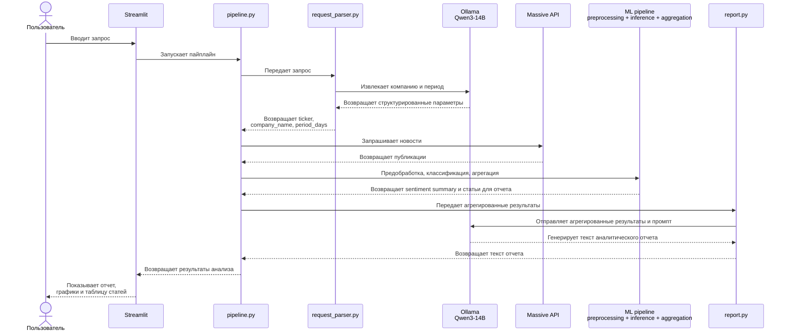

# BRAND HEALTH MONITOR

Приложение для анализа здоровья бренда на основе новостных публикаций в медиа. Сервис загружает новости по выбранной компании, классифицирует тональность публикаций и формирует итоговый аналитический отчет с использованием локально запущенной LLM.

Демонстрация (скринкаст): [Google Drive](https://drive.google.com/file/d/1qBaRY8FBwuzK21VlCnh97g8vRmqZctBv/view?usp=drive_link)

## 1. Структура проекта

```
neto_final/
├── app.py                  # запуск Streamlit-приложения
├── main.py                 # скрипт для локального тестового запуска пайплайна
├── README.md               # описание проекта и инструкция по запуску
├── requirements.txt        # зависимости Python
├── .env.example            # пример файла с переменными окружения
├── .gitignore              # файлы и папки, исключенные из git
│
├── src/
│   ├── api_client.py       # получение новостей через API-запрос к порталу Massive
│   ├── preprocessing.py    # приведение новостей к формату, который ожидает классификатор
│   ├── inference.py        # загрузка моделей и получение предсказаний классификатора
│   ├── aggregation.py      # агрегация результатов и подготовка данных для LLM
│   ├── llm_client.py       # обращение к локальной LLM через Ollama
│   ├── request_parser.py   # парсинг пользовательского запроса в структурированные параметры
│   ├── report.py           # генерация финального аналитического отчета по промпту
│   └── pipeline.py         # полный end-to-end пайплайн анализа
│
├── models/
│   ├── model_classification.cbm  # обученная модель CatBoost-классификатора
│   ├── model_ohe.pkl             # сохраненный OneHotEncoder для признака компании
│   └── model_sbert/              # локальная модель SentenceTransformer для получения эмбеддингов
│
├── notebooks/
│   ├── Project_Dataset_Massive_OHE.ipynb  # EDA, эксперименты с векторизаторами, эмбеддингами и классификаторами
│   └── Catboost_trained.ipynb             # обучение финальной модели CatBoost на лучших параметрах
│
└── data/
    └── dataset_massive.csv       # датасет, сформированный через API-запрос к порталу Massive
```



## 2. Особенности реализации
### 2.1. Использование SentenceTransformer для получения текстовых эмбеддингов

Для представления новостных текстов используется модель SentenceTransformer, которая преобразует каждый текст в плотный вектор признаков. Полученные эмбеддинги объединяются с категориальным признаком компании, закодированным с помощью `OneHotEncoder`, после чего итоговая матрица признаков передается в CatBoost-классификатор. Модель SentenceTransformer хранится в папке `models/model_sbert/` и во время работы приложения загружается из локальной директории.

Папка `model_sbert/` не включена в данный репозиторий из-за большого размера. Для локального запуска приложения разместите модель вручную в директории `models/`.

Пример сохранения модели:

```python
from sentence_transformers import SentenceTransformer

sent_transformer = SentenceTransformer("mukaj/fin-mpnet-base")
sent_transformer.save("models/model_sbert")
```

Дальнейшее использование в приложении:

```python
from sentence_transformers import SentenceTransformer

sent_transformer = SentenceTransformer("models/model_sbert")
```

### 2.2. Использование Ollama для локальной LLM

В проекте используется локально установленная LLM, запущенная через Ollama.

LLM выполняет две функции:

- парсинг пользовательского запроса на естественном языке;
- генерация итогового аналитического отчета.

Чтобы установить Ollama, воспользуйтесь инструкцией на официальном сайте: https://ollama.com/download

В проекте используется модель `Qwen/Qwen3-14B`. Для ее загрузки выполните следующую команду в терминале:

```
ollama pull qwen3:14b
```

Для запуска модели:

```
ollama run qwen3:14b
```

По умолчанию Ollama использует стандартный порт 11434.

## 3. Локальный запуск проекта

### 3.1. Клонирование репозитория

```
git clone https://github.com/karakumka/neto_final.git <имя_папки_проекта>
cd <имя_папки_проекта>
```

### 3.2. Установка зависимостей

Рекомендуется использовать виртуальное окружение.

`python -m venv brand-health` - общая строка для создания виртуального окружения

`brand-health\Scripts\activate` - активация окружения для Windows

`source brand-health/bin/activate` - активация окружения для Linux/macOS

`pip install -r requirements.txt` - установка зависимостей

### 3.3. Переменные окружения

Создайте файл `.env` в корне проекта и укажите:

`MASSIVE_API_KEY=<ваш_ключ_от_Massive>`

Ключ доступен в личном кабинете после регистрации на портале [Massive](https://massive.com/).

### 3.4. Требования в отношении модели SBERT и Ollama

Убедитесь, что в директории `models/` размещена локально сохраненная модель `model_sbert`. Подробнее о сохранении модели SentenceTransformer локально см. раздел 2.1.

Также убедитесь, что на вашем устройстве установлена Ollama и загружена необходимая LLM. Подробнее об установке Ollama и загрузке модели см. раздел 2.2.

Для запуска модели выполните в терминале:

```
ollama run qwen3:14b
```

По умолчанию приложение обращается к Ollama по адресу: `http://localhost:11434/api/generate`.

### 3.5. Запуск Streamlit-приложения:

```
streamlit run app.py
```

После запуска приложение будет доступно в браузере по локальному адресу, который отобразится в терминале, например: `http://localhost:8501`